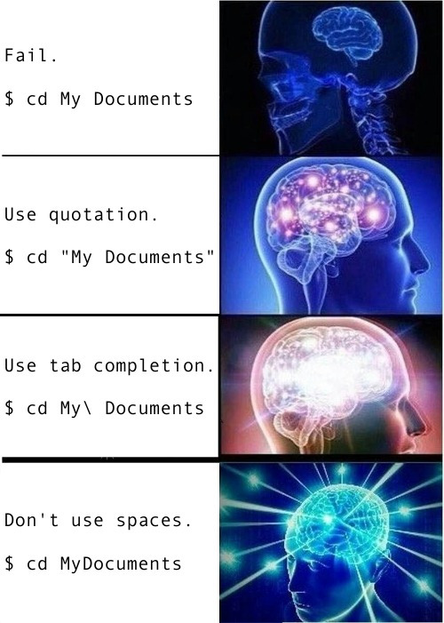

```{r setup, include=FALSE}
# xaringanExtra::use_scribble() ## Draw on slides. Requires dev version of xaringanExtra.
library(tidyverse)
library(hrbrthemes)
library(fontawesome)
```


class: title-slide   


# ECON 525: Data Management & Visualization in Economics 

## Lecture 3: Shell and Command Line
<p align=center>
Cristhian Rosales-Castillo
</p>
<div style="margin-top: -.7cm;"></div>
<p align=center>
Emory University
</p>
</p>
<br>
<p align=center>
Fall 2026
</p>

---

name: toc

# Table of contents

1. [Prologue](#prologue)

2. [Introduction](#intro)

3. [Bash shell basics](#basics)

4. [Files and directories](#files)

5. [Working with text files](#text)

6. [Redirecting and pipes](#pipes)

7. [Iteration (for loops)](#iteration)

8. [Scripting](#scripting)

9. [Next steps](#steps)

10. [Appendix: VS Code shortcuts and Windows](#appendix)


---
class: center, middle
name: prologue

# Prologue

<html><div style='float:left'></div><hr color='#EB811B' size=1px width=1100px></html>


---
# Prologue

- This lecture builds on course materials created by [Marcelo Ortiz](https://marcelortiz.com/), who previously taught ECON 525 at Emory University and generously shared his slides and code with me.

- Marcelo's materials, in turn, acknowledge and build on Grant McDermott's [course materials](https://github.com/uo-ec607/lectures) (Lecture 3), developed during his time at the University of Oregon.

- I have made some modifications to the original materials, but the core content remains the same.

---

# Git GUI

As I said in our previous lecture, the Git + VS Code (and/or the shell) workflow will be optimal for most of you. 

But here are some nice standalone Git GUIs that you might want to consider:
- [Gitkraken](https://www.gitkraken.com/)
- [SourceTree](https://www.sourcetreeapp.com/)
- [GitHub Desktop](https://desktop.github.com/)

---

# Checklist

☑ Have you cloned the [course lecture repo](https://github.com/DataManagementVisual/Econ525-Fall2026) to your local machine?

☑ Once that's done, pull to get the latest lecture slides.

☑ Do you have **Bash**? On Windows, open **Git Bash**, included with the full Git for Windows installation from our previous class. No additional installation is normally needed.

If Git Bash is missing, install [Git for Windows](https://gitforwindows.org/), then search for **Git Bash** in the Start menu. See the [Windows appendix](#windows).

---

# Checklist (cont.)

I'm also going to recommend that you spruce up your GitHub profiles. 
- Add your full name, a profile picture, link to website, etc.
- No-one wants to work with (or hire) a barcode.

--

Today's lecture is the last detour before we get back to data analysis with python/R.
- Laying proper foundations with Git and the shell will put us in a strong position for advanced data science work as the course develops.

---
class: center, middle
name: intro

# Introduction
<html><div style='float:left'></div><hr color='#EB811B' size=1px width=1100px></html>

---

class: shell-compact

# The Unix philosophy

The shell tools that we're going to be using today have their roots in the [Unix](https://en.wikipedia.org/wiki/Unix) family of operating systems whose development began at [Bell Labs in 1969](https://s3-us-west-2.amazonaws.com/belllabs-microsite-unixhistory/takeshape.html).

Besides paying homage, acknowledging the Unix lineage is important because these tools still embody the "[Unix philosophy](https://en.wikipedia.org/wiki/Unix_philosophy)":

<p style="color: #012169; font-weight: 600;">Do One Thing And Do It Well</p>

--

By pairing and chaining well-designed individual components, we can build powerful and much more complex larger systems.
- You can see why the Unix philosophy is also referred to as "minimalist and modular".
  
Again, this philosophy is very clearly expressed in the design and functionality of the Unix shell.


---

class: shell-compact

# Definitions

These terms describe different parts of a **command line interface** (CLI):
- A **terminal** is the application window where you type commands and read output.
- A **shell**, such as Bash, interprets those commands.
- The **prompt** shows that the shell is ready for input. A **tty** is a terminal device.

--

There are many shell variants, but we're going to focus on [**Bash**](https://www.gnu.org/software/bash/) (i.e. **B**ourne **a**gain **sh**ell).
- Bash is common on Linux and available on macOS. macOS defaults to zsh, so type `bash` to follow this lecture in Bash.
- On Windows, use **Git Bash**, already included with the full Git for Windows installation. PowerShell uses different syntax and is not Bash-compatible.

--

For the record, I use **Git Bash** by default for this lecture. Your prompt may look different, but we will all run the same Bash commands.

---

# Why bother with the shell?

1. Power
  - Both for executing commands and for fixing problems. There are some things you just can't do in an IDE or GUI.
  - It also avoids memory complications associated with certain applications and/or IDEs. We'll get to this issue later in the course.
2. Reproducibility
 - Scripting is reproducible, while clicking is not.
3. Interacting with servers and super computers
  - The shell is often the only game in town for high performance computing. We'll get to this later in the course.
4. Automating workflow and analysis pipelines
  - Easily track and reproduce an entire project (e.g. use a Makefile to combine multiple programs, scripts, etc.)

---

# Why bother with the shell? (cont.)

We're going to focus on 1, 2 and 3 in this course. That's not to say that 4 is unimportant (far from it!), but we just won't have time to cover it. 
- [Here](https://stat545.com/automation-overview.html), [the targets manual](https://books.ropensci.org/targets/), and [here](https://web.stanford.edu/~gentzkow/research/CodeAndData.pdf) are great places to start learning about automation on your own.


---

# Things that I use the shell for

- Git
- Renaming and moving files *en masse*
- Finding things on my computer
- Combining and manipulating PDFs
- Installing and updating software
- Scheduling tasks
- Monitoring system resources
- Connecting to cloud environments
- Running analyses ("jobs") on super computers
- etc.

---
class: center, middle
name: basics

# Bash shell basics
<html><div style='float:left'></div><hr color='#EB811B' size=1px width=1100px></html>


---

# First look

We will start **outside VS Code** to explore the shell and its shortcuts.

- **Windows:** Search for **Git Bash** in the Start menu and open it.
- **macOS:** Open **Applications > Utilities > Terminal**, then type `bash` and press Return. [Apple's instructions](https://support.apple.com/guide/terminal/apd5265185d-f365-44cb-8b09-71a064a42125/mac).
- **Linux:** Open your terminal application and run `bash` if needed.

Before the navigation exercises, we will switch to **VS Code** and work in the repository's `03-shell` folder.

In VS Code, **Ctrl + backtick** toggles the terminal on Windows and macOS. **Ctrl+J** (Windows) / **Cmd+J** (macOS) toggles the panel, which may show a different view. [Terminal guide](https://code.visualstudio.com/docs/terminal/basics).

---

# First look (cont.)

You should see something like:

```bash
 username@hostname:~$
```

--

This is shell-speak for: "Who am I and where am I?"
  <!-- - Type in `$ whoami` without the leading dollar sign to confirm. -->


---
count: false

# First look (cont.)

You should see something like:

```bash
 `username`@hostname:~$ 
```

This is shell-speak for: "Who am I and where am I?"

- `username` denotes a specific user (one of potentially many on this computer). 


---
count: false

# First look (cont.)

You should see something like:

```bash
 username`@hostname`:~$ 
```

This is shell-speak for: "Who am I and where am I?"

- `username` denotes a specific user (one of potentially many on this computer). 

- `@hostname` denotes the name of the computer or server.

---
count: false

# First look (cont.)

You should see something like:

```bash
 username@hostname`:~`$ 
```

This is shell-speak for: "Who am I and where am I?"

- `username` denotes a specific user (one of potentially many on this computer). 

- `@hostname` denotes the name of the computer or server.

- `:~` denotes the directory path (where `~` signifies the user's home directory).


---
count: false

# First look (cont.)

You should see something like:

```bash
 username@hostname:~`$`
```

This is shell-speak for: "Who am I and where am I?"

- `username` denotes a specific user (one of potentially many on this computer). 

- `@hostname` denotes the name of the computer or server.

- `:~` denotes the directory path (where `~` signifies the user's home directory).

- `$` denotes the start of the command prompt.
  - We'll get to this later, but for a special "superuser" called root, the dollar sign will change to a `#`.
  
  
---

class: shell-compact

# Useful keyboard shortcuts

- `Tab` completion. Use the `↑` (and `↓`) keys to scroll through previous commands.

- **Bash on Windows and macOS:** Use **Ctrl**, including on a Mac. These shortcuts assume Bash's default Emacs editing mode (`set -o emacs`).

- `Esc`, then `b` / `f`: move back / forward one word. On Windows, `Alt+b` / `Alt+f` also work when the terminal receives them.

- `Ctrl+a` / `Ctrl+e`: move to the beginning / end of the line.

- `Ctrl+k` / `Ctrl+u`: delete to the end / beginning of the line.

- `Ctrl+c`: interrupt a command. It is not Bash's copy shortcut.

- **Copy / paste:** macOS `Cmd+c` / `Cmd+v`; Windows Git Bash and VS Code: use the terminal’s right-click **Copy / Paste** menu.

- `clear` to clear your terminal.

---

class: shell-compact

# Syntax

Most simple shell commands follow this pattern:

**<center>command option(s) argument(s)</center>**

Examples:

  ```bash
  $ ls -lh ~/Documents/
  ```
  ```bash
  $ sort -u myfile.txt
  ```

---
count: false

class: shell-compact

# Syntax

Most simple shell commands follow this pattern:

**<center><span style='background: #ffff88;'>command</span> option(s) argument(s)</center>**

Examples:

  ```bash
  $ `ls` -lh ~/Documents/
  ```
  ```bash
  $ `sort` -u myfile.txt
  ```

---
count: false

class: shell-compact

# Syntax

Most simple shell commands follow this pattern:

**<center>command <span style='background: #ffff88;'>option(s)</span> argument(s)</center>**

Examples:

  ```bash
  $ ls `-lh` ~/Documents/
  ```
  ```bash
  $ sort `-u` myfile.txt
  ```


---
count: false

class: shell-compact

# Syntax

Most simple shell commands follow this pattern:

**<center>command option(s) <span style='background: #ffff88;'>argument(s)</span></center>**

Examples:

  ```bash
  $ ls -lh `~/Documents/`
  ```
  ```bash
  $ sort -u `myfile.txt`
  ```

---

class: shell-compact

# Syntax

Most simple shell commands follow this pattern:

**<center>command option(s) argument(s)</center>**

Examples:

  ```bash
  $ ls -lh ~/Documents/
  ```
  ```bash
  $ sort -u myfile.txt
  ```

**commands**
- You don't always need options or arguments. (E.g. `$ ls ~/Documents/` and `$ ls -lh` are both valid commands that will yield output.)
- Bash also supports assignments, redirections, and compound constructs such as loops, which have their own syntax.

---

# Help: man

On **macOS / Linux**, `man` opens installed manual pages:

```bash
man ls
```

In the usual `less` pager: Space moves down, `h` opens pager help, and `q` quits.

**Git Bash** normally does not include `man`. Use these built-in alternatives:

```bash
ls --help | less   # Help for the GNU ls command
help cd            # Help for a Bash built-in
```

In PowerShell, `man` is an alias for its own help system. It does not show the Bash manual. [PowerShell help](https://learn.microsoft.com/en-us/powershell/module/microsoft.powershell.core/get-help).

---

# Help in Git Bash

Git Bash does not normally ship a Unix manual-page reader. You do **not** need to install one for this class.

- For GNU tools, use `ls --help | less`; for Bash built-ins, use `help cd`.
- For Git's installed HTML documentation, use `git help -w add` (replace `add` with the Git command).
- Read full manual pages online: [GNU Coreutils](https://www.gnu.org/software/coreutils/manual/coreutils.html) and [Bash](https://www.gnu.org/software/bash/manual/bash.html).
- If you already use WSL with manual pages installed, `wsl man ls` opens the Linux manual from Git Bash. This is optional; it is not Git Bash's own `man`.


---

# Help: cheat

For Linux and macOS users, [cheat](https://github.com/cheat/cheat) is a useful optional utility for short command examples. **It also supports Windows**, including use from Git Bash.

- **macOS / Linux:** Follow the [installation guide](https://github.com/cheat/cheat/blob/master/INSTALLING.md) (Homebrew or a release binary).
- **Windows:** Follow the same guide's Windows section: unzip the Windows release and put `cheat.exe` in a folder on your `PATH`. Restart your terminal.
- On first launch, follow the prompts to create the configuration and install the community cheatsheets. No installation is required for today's exercises.

---

# Help: cheat (cont.)

```
$ cheat ls

## # Displays everything in the target directory
## ls path/to/the/target/directory
## 
## # Displays everything including hidden files
## ls -a
## 
## # Displays all files, along with the size (with unit suffixes) and timestamp
## ls -lh 
## 
## # Display files, sorted by size
## ls -S
## 
## # Display directories only
## ls -d */
## 
## # Display directories only, include hidden
## ls -d .*/ */
```

---
class: center, middle
name: files

# Files and directories
<html><div style='float:left'></div><hr color='#EB811B' size=1px width=1100px></html>

---

# Our working folder in VS Code

**From now on, we will use VS Code for the exercises.**

1. Open your cloned `Econ525-Fall2026` repository in VS Code.
2. Open the Command Palette: **Ctrl+Shift+P** (Windows) / **Cmd+Shift+P** (macOS). Run **Terminal: Select Default Profile** and choose **Git Bash** (Windows) or **bash** (macOS).
3. In Explorer, right-click **03-shell** and choose **Open in Integrated Terminal**. Check the terminal profile; create a new terminal if the old one still uses PowerShell or zsh.

We will start in `Econ525-Fall2026/03-shell`. Keep this folder as the starting point for each example unless instructed otherwise.

---

# Open the same folder with cd

Alternatively, copy the folder's full path from your file manager and use `cd`. **Quote paths containing spaces.** Use forward slashes in Bash.

```bash
# Windows / Git Bash example: replace with your own clone location
cd "/c/Users/YOUR_USERNAME/Documents/Econ525-Fall2026/03-shell"

# macOS example: replace with your own clone location
cd "/Users/YOUR_USERNAME/Documents/Econ525-Fall2026/03-shell"

pwd
```

For a clone on Windows drive D:, Git Bash paths start with `/d/`. In VS Code, right-clicking **03-shell > Open in Integrated Terminal** avoids typing the full path.

---

# Navigation

Key navigation commands:

- `pwd` to print (the current) working directory.

- `cd` to change directory.

```bash
pwd
```

Example output (your username and clone location will differ):

```text
/c/Users/YOUR_USERNAME/Documents/Econ525-Fall2026/03-shell
```

---

# Navigation (cont.)

You can use absolute paths, but it's better to use relative paths and invoke special symbols for a user's home folder (`~`), current directory (`.`), and parent directory (`..`) as needed. 

```bash
cd ..          # Move from 03-shell to the repository root
pwd
```

```text
/c/Users/YOUR_USERNAME/Documents/Econ525-Fall2026
```

```bash
cd 03-shell    # Return to our working folder before continuing
```


---

# Navigation (cont.)

Beware of directory names that contain spaces. Say you have a directory called "My Documents". (I'm looking at you, Windows.)

- Why won't `$ cd My Documents` work?

--

**Answer:** Bash syntax is super pedantic about spaces and ordering. Here it thinks that "My" and "Documents" are separate arguments.

--

  - Small brain: Use quotation marks: `$ cd "My Documents"`.

  - Big brain: Use Tab completion to automatically "escape" the space: `$ cd My\ Documents`. 
  
  - Galaxy brain: Don't use spaces in file and folder names.

---

# Navigation (cont.)

<div align="center">

</div>

---

class: shell-compact

# Listing files and their properties

We're about to go into more depth about the `ls` command.
- To do this effectively, it will be helpful if we're all working off the same group of files and folders.
- Navigate to the directory containing these lecture notes (i.e. `03-shell`). Now list the contents of the  `examples/` sub-directory with the `-lh` option ("long format", "human readable").

```bash
# cd "PathWhereYouClonedThisRepo/Econ525-Fall2026/03-shell"
ls -lh examples
```

---
class: shell-compact

# Listing files and their properties (example)

Example from my Git Bash terminal (names, sizes, and dates may differ):

```text
total 128K
drwxr-xr-x 1 patoc 197609    0 Aug 23 22:42 ABC/
drwxr-xr-x 1 patoc 197609    0 Aug 23 22:42 copies/
-rw-r--r-- 1 patoc 197609  149 Aug 23 22:46 hello.R
-rwxr-xr-x 1 patoc 197609  103 Aug 23 22:46 hello.sh*
drwxr-xr-x 1 patoc 197609    0 Aug 23 22:42 meals/
-rw-r--r-- 1 patoc 197609   32 Aug 23 22:46 nursery.txt
-rw-r--r-- 1 patoc 197609  153 Aug 23 22:46 reps.txt
-rw-r--r-- 1 patoc 197609 117K Aug 23 22:46 sonnets.txt
```

The `/` and `*` suffixes come from classification options in my `ls` setup; plain `ls -lh` may omit them.

---

class: shell-compact

# Listing files and their properties (cont.)

What does this all mean? Let's focus on the top line.

```bash
drwxr-xr-x  1 patoc  197609    0 Aug 23 22:42 ABC/
```

---
count:false

class: shell-compact

# Listing files and their properties (cont.)

What does this all mean? Let's focus on the top line.

<p span style="font-family:Fira Code; font-size:80%; color: #333; background: #f8f8f8; padding: 0.5em;";>
<span style='background: #ffff88;'>d</span>rwxr-xr-x 1 patoc  197609    0 Aug 23 22:42 ABC/</span>

- The first column denotes the object type:
  - `d` (directory or folder), `l` (link), or `-` (file)

---

count:false

class: shell-compact

# Listing files and their properties (cont.)

What does this all mean? Let's focus on the top line.

<p span style="font-family:Fira Code; font-size:80%; color: #333; background: #f8f8f8; padding: 0.5em;";>d<span style='background: #ffff88;'><span style='color: #e41a1c;'>rwx</span><span style='color: #377eb8;'>r-x</span><span style='color: #4daf4a;'>r-x</span></span> 1 patoc  197609    0 Aug 23 22:42 ABC/</span>

- <span style='color: #A9A9A9;'>The first column denotes the object type:
  - `d` (directory or folder), `l` (link), or `-` (file)</span>
- Next, we see the permissions associated with the object's three possible user types: 1) <span style='color: #e41a1c;'>owner</span>, 2) <span style='color: #377eb8;'>the file's owning group</span>, and 3) <span style='color: #4daf4a;'>all other users</span>.
  - Permissions reflect `r` (read), `w` (write), or `x` (execute) access.
  - <b>`-`</b> denotes missing permissions for a class of operations.

---
count:false

class: shell-compact

# Listing files and their properties (cont.)

What does this all mean? Let's focus on the top line.

<p span style="font-family:Fira Code; font-size:80%; color: #333; background: #f8f8f8; padding: 0.5em;";>drwxr-xr-x <span style='background: #ffff88;'>1</span> patoc 197609 0 Aug 23 22:42 ABC/</span>

- <span style='color: #A9A9A9;'>The first column denotes the object type:
  - `d` (directory or folder), `l` (link), or `-` (file)</span>
- <span style='color: #A9A9A9;'>Next, we see the permissions associated with the object's three possible user types: 1) owner, 2) the file's owning group, and 3) all other users.
  - Permissions reflect `r` (read), `w` (write), or `x` (execute) access.
  - <b>`-`</b> denotes missing permissions for a class of operations.</span>
- The number of [hard links](https://www.gnu.org/software/coreutils/manual/html_node/ln-invocation.html) to the object.

---
count:false

class: shell-compact

# Listing files and their properties (cont.)

What does this all mean? Let's focus on the top line.

<p span style="font-family:Fira Code; font-size:80%; color: #333; background: #f8f8f8; padding: 0.5em;";>drwxr-xr-x 1 <span style='background: #ffff88;'><span style='color: #e41a1c;'>patoc</span> <span style='color: #377eb8;'>197609</span></span> 0 Aug 23 22:42 ABC/</span>

- <span style='color: #A9A9A9;'>The first column denotes the object type:
  - `d` (directory or folder), `l` (link), or `-` (file)</span>
- <span style='color: #A9A9A9;'>Next, we see the permissions associated with the object's three possible user types: 1) owner, 2) the file's owning group, and 3) all other users.
  - Permissions reflect `r` (read), `w` (write), or `x` (execute) access.
  - <b>`-`</b> denotes missing permissions for a class of operations.</span>
- <span style='color: #A9A9A9;'>The number of hard links to the object.</span>
- We also see the identity of the object's <span style='color: #e41a1c;'>owner</span> and the file's owning <span style='color: #377eb8;'>group</span>.
- A **group** is a set of users used for access permissions. Here, `197609` is the numeric group ID shown by Git Bash when it does not resolve a group name; it is not a size or user count.

---
count:false

class: shell-compact

# Listing files and their properties (cont.)

What does this all mean? Let's focus on the top line.

<p span style="font-family:Fira Code; font-size:80%; color: #333; background: #f8f8f8; padding: 0.5em;";>drwxr-xr-x 1 patoc 197609 <span style='background: #ffff88;'>0 Aug 23 22:42 ABC/</span></span>

- <span style='color: #A9A9A9;'>The first column denotes the object type:
  - `d` (directory or folder), `l` (link), or `-` (file)</span>
- <span style='color: #A9A9A9;'>Next, we see the permissions associated with the object's three possible user types: 1) owner, 2) the file's owning group, and 3) all other users.
  - Permissions reflect `r` (read), `w` (write), or `x` (execute) access.
  - <b>`-`</b> denotes missing permissions for a class of operations.</span>
- <span style='color: #A9A9A9;'>The number of hard links to the object.</span>
- <span style='color: #A9A9A9;'>We also see the identity of the object's owner and the file's owning group.</span>
- Finally, we see some descriptive elements about the object: 
  - Size, last modification date and time (not creation), and the object name.

---
count:false

class: shell-compact

# Listing files and their properties (cont.)

What does this all mean? Let's focus on the top line.

```bash
drwxr-xr-x  1 patoc  197609    0 Aug 23 22:42 ABC/
```

- The first column denotes the object type:
  - `d` (directory or folder), `l` (link), or `-` (file)
- Next, we see the permissions associated with the object's three possible user types: 1) owner, 2) the file's owning group, and 3) all other users.
  - Permissions reflect `r` (read), `w` (write), or `x` (execute) access.
  - <b>`-`</b> denotes missing permissions for a class of operations.
- The number of hard links to the object.
- We also see the identity of the object's owner and the file's owning group.
- Finally, we see some descriptive elements about the object: 
  - Size, last modification date and time (not creation), and the object name.

---

class: shell-compact

# Create: touch and mkdir

One of the most common shell tasks is object creation (files, directories, etc.)

We use `mkdir` to create directories. E.g. To create a new "testing" directory:
```{bash mkdir}
mkdir testing
```

For a new filename, `touch` creates an empty file. For an existing file, it updates timestamps without clearing its contents. Add files to our new directory:
```{bash touch}
touch testing/test1.txt testing/test2.txt testing/test3.txt
```

--

Check that it worked:
```{bash}
ls testing
```

---

class: shell-compact

# Remove: rm and rmdir

Use `rm` to remove one of our practice files:

```{bash rm1}
rm testing/test1.txt
```

The equivalent command for directories is `rmdir`.
```{bash rmdir, error=T}
rmdir testing
```

--

The directory still contains files. Use `rm -r` to remove a directory and its contents.
- `-f` suppresses confirmation prompts and ignores missing files. Omitting it does **not** request confirmation for every file.
- Use `rm -ri testing` to ask before each removal. The example below deletes our disposable practice folder without prompting. Check the path first.

```{bash rm2, error=T}
rm -rf testing ## Success
```

---

class: shell-compact

# Copy: cp

The syntax for copying is `$ cp object path/copyname`
- If you don't provide a new name for the copied object, it will just take the old name.
- By default, `cp` can overwrite an existing writable destination. Use `cp -i` to ask first. The `-f` option tries removing and recreating a destination that cannot be opened for writing.

```{bash cp}
## Create new "copies" sub-directory
mkdir examples/copies
## Now copy across a file (with a new name)
cp examples/reps.txt examples/copies/reps-copy.txt
## Show that we were successful
ls examples/copies
```

--

You can use `cp` to copy directories, although you'll need the `-r` (or `-R`) flag if you want to recursively copy over everything inside of it to. 
- Try this by copying over the `meals/` sub-directory to `copies/`.


---

# Move (and rename): mv 

The syntax for moving is `$ mv object path/newobjectname` 

```{bash mv1}
 ## Move the abc.txt file and show that it worked
mv examples/ABC/abc.txt examples
ls examples/ABC ## empty
```
```{bash mv2}
## Move it back again
mv examples/abc.txt examples/ABC
ls examples/ABC ## not empty
```

--

Note that "moving" an object within the same directory, but with the (newobjectname) option, is effectively the same as renaming it.

```{bash mv3}
 ## Rename reps-copy to reps2 by "moving" it with a new name
mv examples/copies/reps-copy.txt examples/copies/reps2.txt
ls examples/copies
```

---

# Rename _en masse_: mv

For example, say we want to change the file type (i.e. extension) of a particular file in the `examples/meals` directory.

```{bash rename1}
mv examples/meals/monday.csv examples/meals/monday.TXT
ls examples/meals
```

---

# Rename _en masse_: mv (cont.)

Where `mv` really shines, however, is in conjunction with regular expressions and wildcards (more on the next slide).
- This works especially well for dealing with a whole list of files or folders.

For example, let's change _all_ of the file extensions in the `examples/meals` directory.

```{bash rename2}
find examples/meals/ -name "*.csv" -exec bash -c 'mv "$0" "${0%.csv}.TXT"' {} \;
ls examples/meals
```

---
# Rename _en masse_: mv (cont.)

Better change them back before we continue. (Confirm that this worked for yourself.)

```{bash rename3}
find examples/meals/ -name "*.TXT" -exec bash -c 'mv "$0" "${0%.TXT}.csv"' {} \;
ls examples/meals
```
---

# Wildcards

[Wildcards](http://tldp.org/LDP/GNU-Linux-Tools-Summary/html/x11655.htm) are special characters that can be used as a replacement for other characters. The two most important ones are:

1. Replace any number of characters with `*`. 
 - Convenient when you want to copy, move, or delete a whole class of files.
```{bash asterisk}
  cp examples/*.sh examples/copies ## Copy any file with an .sh extension to "copies"
  rm examples/copies/* ## Delete everything in the "copies" directory
```

2. Replace a single character with `?`
 - Convenient when you want to discriminate between similarly named files.
```{bash qmark}
  ls examples/meals/??nday.csv
  ls examples/meals/?onday.csv
```  

```{bash, echo = F}
## Remove "copies" sub-dir to avoid "file already exists" problem when re-knitting this doc
rm -rf examples/copies
```

---

class: shell-compact

# Find

The last command that I want to mention w.r.t. navigation is `find`.
- This can be used to locate files and directories based on a variety of criteria; from pattern matching to object properties.

```{bash find1}
find examples -iname "monday.csv" ## will automatically do recursive
```
```bash
find . -iname "*.txt" ## "." starts the search in the current directory
```
```text
./examples/ABC/abc.txt
./examples/nursery.txt
./examples/reps.txt
./examples/sonnets.txt
./survive.txt
```

This is my example output. `survive.txt` appears only if it already exists; we create it later. Your results depend on the files currently present.
---

# Find (cont.)

We can also search by file size:

```bash
find . -size +100k ## Find files larger than 100 KiB
```

Example output for the starter files distributed with this lecture:

```text
./03slides.html
./examples/sonnets.txt
```

---
class: center, middle
name: text

# Working with text files
<html><div style='float:left'></div><hr color='#EB811B' size=1px width=1100px></html>


---

# Motivation

Economists and other (data) scientists spend a lot of time working with text, including scripts, Markdown documents, and delimited text files like CSVs. 

It therefore makes sense to spend a few slides showing off some Bash shell capabilities for working with text files.
- We'll only scratch the surface, but hopefully you'll get an idea of how powerful the shell is in the text domain.

---

class: shell-compact

# Counting text: wc

By default, `wc` reports newline, word, and **byte** counts, in that order. Use `wc -m` to count characters instead of bytes.

Let's demonstrate with a text file containing all of Shakespeare's Sonnets.<sup>1</sup>

```{bash wc}
wc examples/sonnets.txt
```

In this output: **3029** = lines (newline characters), **20701** = words, and **122780** = bytes.

.footnote[
<sup>1</sup> Courtesy of [Project Gutenburg](http://www.gutenberg.org/cache/epub/1041/pg1041.txt).
]

--

Newline bytes count toward the total. UTF-8 characters can occupy multiple bytes, and Windows CRLF line endings use two bytes per newline. Your byte count may differ with encoding or line endings.

---

# Reading text

### Read everything: cat

The simplest way to read in text is with the `cat` ("concatenate") command. Note that `cat` will read in *all* of the text. You can scroll back up in your shell window, but this can still be a pain.

Again, let's demonstrate using Shakespeare's Sonnets. (This will overflow the slide.)
- I'm also going to use the `-n` flag because I want to show line numbers.

---

# Reading text (cont.)

```{bash cat}
cat -n examples/sonnets.txt
```

---

# Reading text (cont.)

### Scroll: less

The `less` command lets you move through long text one page at a time. We will use it in Git Bash, macOS, and Linux.
- Try this yourself with `$ less examples/sonnets.txt`
- You can move forward and back using the "f" and "b" keys, and quit by hitting "q".
- On macOS and Linux, `more` is another pager, but we will use `less` throughout this exercise.

---

# Reading text (cont.)

### Preview: head and tail

The `head` and `tail` commands let you limit yourself to a preview of the text, down to a specified number of rows. (The default is 10 rows if you don't specify a number.)

```{bash head}
head -n 3 examples/sonnets.txt ## First 3 rows
# head examples/sonnets.txt ## First 10 rows (default)
```

---

# Reading text (cont.)

### Preview: head and tail (cont.)

`tail` works very similarly to `head`, but starting from the bottom. For example, we can see the very last row of a file as follows

```{bash tail1}
tail -n 1 examples/sonnets.txt ## Last row
```

---

# Reading text (cont.)

However, there's one other neat option that I want to show you. By using the `-n +N` option, we can specify that we want to preview all lines starting from row N *and after*. E.g.

```{bash tail2}
tail -n +3024 examples/sonnets.txt ## Show everything from line 3024
```

---

class: shell-compact

# Find patterns: grep

To find patterns in text, we can use regular expression-type matching with `grep`. 

For example, say we want to find the famous opening line to Shakespeare's [Sonnet 18](https://en.wikipedia.org/wiki/Sonnet_18).
- I'm going to include the `-n` ("number") flag to get the line that it occurs on. 

```{bash grep1}
grep -n "Shall I compare thee" examples/sonnets.txt
```

--

By default, `grep` prints each line containing a match. Use `grep -o` to print only the matching parts. 
- What happens if you run `$ grep -n "summer" examples/sonnets.txt`?
- Or, for that matter, `$ grep -n "the" examples/sonnets.txt`?


---

# Find patterns: grep (cont.)

Note that `grep` can be used to identify patterns in a group files (e.g. within a directory) too.
 - This is particularly useful if you are trying to identify a file that contain, say, a function name. 
 
Here's a simple example: Which days will I eat pasta this week? 
 - I'm using the `R` (recursive) and `l` (just list the files; don't print the output) flags.

```{bash grep2}
grep -Rl "pasta" examples/meals
```

--

What about muesli? And pizza?

---

# Sorting and removing duplicates: sort

We can remove duplicate lines in various ways in Bash, but I'll demonstrate using `sort`.

```{bash reps}
cat examples/reps.txt
```

There's a fair bit of repetition in this file (and a double entendre). Let's fix that. 

---
# Sorting and removing duplicates: sort (cont.)

- Note the use of the `-u` ("unique") flag to remove duplicates. I'll also add a `-r` ("reverse") flag, but only because `sort` orders alphabetically and this makes less sense for this simple example.

```{bash sort}
sort -ur examples/reps.txt
```


---
class: center, middle
name: pipes

# Redirecting and pipes
<html><div style='float:left'></div><hr color='#EB811B' size=1px width=1100px></html>

---

# Redirect: >

You can send output from the shell to a file using the redirect operator `>`

For example, let's print a message to the shell using the `echo` command.

```{bash}
echo "At first, I was afraid, I was petrified"
```

--

If you wanted to save this output to a file, you need simply redirect it to the filename of choice.

```{bash}
echo "At first, I was afraid, I was petrified" > survive.txt
find survive.txt ## Show that it now exists
```

---

# Redirect: > (cont.)

If you want to *append* text to an existing file, then you should use `>>`.
- Using `>` will try to overwrite the existing file contents.

```{bash}
echo "'Kept thinking I could never live without you by my side" >> survive.txt
cat survive.txt
```

```{bash, echo = F}
## Remove file so that we don't keep adding to it when we re-knit these slides
rm survive.txt
```

--

(Probably you might guess correctly, it is the lyrics to Gloria Gaynor's "[I Will Survive](https://www.youtube.com/watch?v=ihUF8pbphbk)".)

Aside: I often use this sequence when adding files to my .gitignore. E.g. `$ echo "*.csv" >>  .gitignore`.


---

# Pipes: |

The pipe operator `|` is one of the coolest features in Bash.
- It lets you send (i.e. "pipe") intermediate output to another command.
- In other words, it allows us to chain together a sequence of simple operations and thereby implement a more complex operation. (Remember the Unix philosophy!)

Let me demonstrate using a very simple example.

```{bash pipe1}
cat -n examples/sonnets.txt | head -n100 | tail -n10
```

---

class: shell-compact

# Pipes: | (cont.)

Exercise: Extract only the 14 lines of Sonnet 18.
- Use a pipe and the commands we have learned. The first line is 336.

--

```{bash pipe2}
tail -n +336 examples/sonnets.txt | head -n14
```

---

class: shell-compact

# Pipes: | (cont.)

You can use a pipe to search your Bash command history.

Try `history | grep head` to include commands from the current session.

- Bash normally saves history when an interactive shell exits, using `HISTFILE` (usually `~/.bash_history`).
- History filters, size limits, and settings affect which commands are retained.
- `cat ~/.bash_history | grep head` searches the saved file only, if it exists.
- Other shells use their own settings. In zsh, the history-file path is configurable through `HISTFILE`.


---
class: center, middle
name: iteration

# Iteration (_for_ loops)
<html><div style='float:left'></div><hr color='#EB811B' size=1px width=1100px></html>

---

class: shell-compact

# _for_ loop syntax

_for_ loops in Bash work similarly to other programming languages that you are probably familiar with. 

The basic syntax is 

```bash
for i in LIST
do 
  OPERATION "$i" ## the $ sign indicates a variable in bash
done
```

--

We can also condense things into a single line by using ";" appropriately. 

```bash
for i in LIST; do OPERATION "$i"; done
```

--

I find the top approach more readable, but I may use single line approach in these slides to save vertical space.
- Semicolons separate commands on the same line. They also separate the loop body from `done` in the one-line form.

---

class: shell-compact

# Example 1: Print a sequence of numbers

To help make things concrete, here's a simple _for_ loop in action.

```{bash for1a}
for i in 1 2 3 4 5; do echo $i; done
```

--

Bash brace expansion, such as `{1..5}`, produces a sequence with literal endpoints. A shell variable will not work as an endpoint in `{1..$n}`.

```{bash for1b}
for i in {1..5}; do echo $i; done
```


---
name: combine_csvs

# Example 2: Combine CSVs

Here's a more realistic _for_ loop use-case that I use quite often: Combining (i.e. concatenating) multiple CSVs. 

--

Say we want to combine all the "daily" files in the `examples/meals` directory into a single CSV, which I'll call `mealplan.csv`. Here's one attempt that incorporates various bash commands and tricks that we've learned so far. The basic idea is:
1. Create an empty output CSV (or clear that output file if it already exists)
2. Then, loop over the relevant input files, appending their contents to our new CSV

---

```{bash for2a, echo = FALSE}
: > examples/meals/mealplan.csv 
for i in examples/meals/*day.csv
do 
  cat "$i" >> examples/meals/mealplan.csv
done
```
```bash
## create or empty the output CSV (overwrites its existing contents)
$ : > examples/meals/mealplan.csv
## loop over the input files and append their contents to our new CSV
$ for i in examples/meals/*day.csv
> do 
>   cat "$i" >> examples/meals/mealplan.csv
> done
```

--

The unquoted `*day.csv` glob expands to the daily files. Quoting `"$i"` keeps each filename together, even if it contains spaces. This pattern excludes `mealplan.csv`.

Did it work? (See next slide.)

---

class: shell-compact

# Example 2: Combine CSVs (cont.)

```{bash for2b}
cat examples/meals/mealplan.csv
```

--

The header repeats. We need to keep only one copy.

--

How could we do that? (_Hint:_ `tail` and `head`. See the next slide.)

---

class: shell-compact

# Example 2: Combine CSVs (cont.)

Let's try again. First delete the old file so we can start afresh.
```{bash for2c}
rm -f examples/meals/mealplan.csv ## delete old file
```

--

Here's our adapted gameplan:
- First, create the new file by grabbing the header (i.e. top line) from any of the input files and redirecting it. The redirection creates or replaces the output file.
- Next, loop over all the input files as before, but this time only append everything _after_ the top line.

---

```{bash for2d, echo = FALSE}
head -n 1 examples/meals/monday.csv > examples/meals/mealplan.csv
for i in examples/meals/*day.csv
do 
  tail -n +2 "$i" >> examples/meals/mealplan.csv
done
```
```bash
## create a new CSV by redirecting the top line of any file
$ head -n 1 examples/meals/monday.csv > examples/meals/mealplan.csv
## loop over the input files, appending everything after the top line
$ for i in examples/meals/*day.csv
> do 
>   tail -n +2 "$i" >> examples/meals/mealplan.csv
> done
```

---

class: shell-compact

# Example 2: Combine CSVs (cont.)

It worked!

```{bash for2e}
cat examples/meals/mealplan.csv
```

---
class: shell-compact

# Example 2: Combine CSVs (cont.)

We still have to sort the correct week order, but that's an easy job in Python (or Stata, R, etc.)
- The explicit benefit of doing the concatenating in the shell is it is _much_ more efficient, since all the files don't simultaneously have to be held in memory (i.e RAM). 
- This doesn't matter here, but can make a dramatic difference once we start working with lots of files (or even a few really big ones). We'll revisit this idea later in the big data section of the course.

```{bash for2f, echo = FALSE}
rm -f examples/meals/mealplan.csv ## Silently remove to avoid errors with later re-knits
```


---
class: center, middle
name: scripting

# Scripting
<html><div style='float:left'></div><hr color='#EB811B' size=1px width=1100px></html>

---

class: shell-compact

# Hello World!

Writing code and commands interactively in the shell makes a lot of sense when you are exploring data, file structures, etc.

However, it's also possible (and often desirable) to write reproducible shell scripts that combine a sequence of commands.
- The `.sh` extension is a naming convention. Bash can run a script without that extension.

--

Let's look at the contents of a short shell script that I've included in the examples folder.

```{bash hello}
cat examples/hello.sh
```

---

class: shell-compact

# Hello World! (cont.)

```bash
*#!/usr/bin/env bash
echo -e "\nHello World!\n"

```

- The [shebang](https://www.gnu.org/software/bash/manual/html_node/Shell-Scripts.html) `#!/usr/bin/env bash` selects Bash from `PATH` when the script runs directly. `/bin/sh` can select a different shell, so use Bash for these examples.

---
count: false

class: shell-compact

# Hello World! (cont.)

```bash
#!/usr/bin/env bash
*echo -e "\nHello World!\n"

```

- The [shebang](https://www.gnu.org/software/bash/manual/html_node/Shell-Scripts.html) `#!/usr/bin/env bash` selects Bash from `PATH` when the script runs directly. `/bin/sh` can select a different shell, so use Bash for these examples.
- `echo -e "\nHello World!\n"` is the actual command that we want to run.

---
count: false

class: shell-compact

# Hello World! (cont.)

```bash
#!/usr/bin/env bash
echo -e "\nHello World!\n"

```

- The [shebang](https://www.gnu.org/software/bash/manual/html_node/Shell-Scripts.html) `#!/usr/bin/env bash` selects Bash from `PATH` when the script runs directly. `/bin/sh` can select a different shell, so use Bash for these examples.
- `echo -e "\nHello World!\n"` is the actual command that we want to run. In Bash, `-e` interprets backslash escapes such as `\n` (newline). For portable shell scripts, `printf` is a better choice.

Run the script explicitly with Bash. This does not require the script itself to have executable permission. Save shell scripts with **LF** line endings (select **LF** in the VS Code status bar).

```{bash hello_run}
bash examples/hello.sh
```

---

class: shell-compact

# Editing and writing scripts in the shell

Say you want to edit my (amazing) `hello.sh` script. 
- Maybe you want to add some additional lines of text, or maybe you're bothered by the fact that there should be a comma after "Hello". (It's a salutation!) 

We have already seen how to append text lines to a file. But when it comes to more complicated editing work, you're better off using a dedicated shell editor.
- An easier starting point is [**nano**](https://www.nano-editor.org/). On Windows, the full [Git for Windows](https://gitforwindows.org/) installation includes nano, so you can use it directly in Git Bash.

Open up my script in nano by typing `$ nano examples/hello.sh`. 
- Note that the functionality is more limited than a normal text editor.
- Once you are finished editing, press **Ctrl+X** (Windows and macOS), then **Y** and Enter to save and exit (or **N** to discard changes).
- Finally, run the edited version of the script.


---
class: center, middle
name: steps

# Next steps
<html><div style='float:left'></div><hr color='#EB811B' size=1px width=1100px></html>

---

# Things we didn't cover today

I know we covered a _lot_ of ground today. I hope that I've given you a sense of how Bash works and how powerful it is.
- My main goal has been to "demystify" the shell, so that you aren't intimidated when we use shell commands later on.

At the same time, there's loads that we didn't cover.
- Environment variables, SSH, memory management (e.g. [top](https://ss64.com/bash/top.html) and [htop](https://htop.dev/)), GNU parallel, etc.
- We'll get to some of these topics in the later lectures, but please try to work some of the suggested exercises on the next slide and make use of the recommended readings.
 
---

# Next steps

### Exercises

We are going to have a in-class assessment to practice some of the things we've learned today. See information on Canvas!

### Further reading

- [The Unix Shell](http://swcarpentry.github.io/shell-novice/) (Software Carpentery)
- [The Unix Workbench](https://seankross.com/the-unix-workbench/) (Sean Kross)
- [Data Science at the Command Line](https://jeroenjanssens.com/dsatcl/) (Jeroen Janssens)


---
class: center, middle

# Next class: *Python* language basics
<html><div style='float:left'></div><hr color='#EB811B' size=1px width=1100px></html>

---
class: center, middle
name: appendix

# Appendix
<html><div style='float:left'></div><hr color='#EB811B' size=1px width=1100px></html>


---

name: vscode-shortcuts

# Bash shortcuts inside VS Code

Click inside the **Git Bash terminal** before using a Bash shortcut. Some keys are intercepted by VS Code.

Open the Command Palette and choose **Preferences: Open User Settings (JSON)**. Merge these entries into the existing object; do not replace your other settings:

```json
"terminal.integrated.sendKeybindingsToShell": true,
"terminal.integrated.allowChords": false,
"terminal.integrated.allowMnemonics": false
```

These settings send most shortcuts to the shell and let Bash receive **Ctrl+K** and Alt combinations. They affect other terminal profiles too; VS Code shortcuts such as terminal Find may stop working while the terminal is focused. [VS Code documentation](https://code.visualstudio.com/docs/terminal/advanced).

---

# Bash shortcuts inside VS Code (cont.)

- In Git Bash, run `set -o emacs` to use the editing mode assumed in this lecture.
- Try **Ctrl+A / Ctrl+E**, **Ctrl+U / Ctrl+K**, and **Esc, then b / f**. Bash uses **Ctrl on both Windows and macOS**, not Cmd.
- **Copy / paste:** Use the terminal’s right-click **Copy / Paste** menu on Windows. On macOS, use **Cmd+C / Cmd+V** or the same menu. The settings above may intercept keyboard copy / paste actions.
- If a shortcut still fails, open **Keyboard Shortcuts** from the Command Palette and check for a conflicting custom binding.

Standalone Git Bash is a fallback if local keybindings interfere. The Bash commands are the same in either terminal.

---
name: windows

# Bash on Windows

### For this class: [Git Bash](https://gitforwindows.org/)

- Included with the full Git for Windows installation from our previous lecture.
- Provides Bash and common Unix tools for today's exercises, not just Git commands.
- Open **Git Bash** from the Start menu, or select its terminal profile in VS Code.
- If it is missing, install Git for Windows. No separate Bash installation is normally needed.

### Optional: [Windows Subsystem for Linux (WSL)](https://learn.microsoft.com/en-us/windows/wsl/install)

WSL provides a Linux environment on supported Windows 10 / 11 systems. It is useful for a wider range of Linux software, but **is not required for this class**. The following slides are optional reference material.


---
name:wsl

# WSL

The basic WSL installation guide is [**here**](https://learn.microsoft.com/en-us/windows/wsl/install). 
- Follow the guide to install your preferred Linux distro. [Ubuntu](https://www.microsoft.com/en-us/p/ubuntu/9nblggh4msv6) is a good choice. 
- Then, once you've restarted your PC, come back to these slides.

After installing your chosen WSL, you need to navigate to today's lecture directory to run the examples. You have two options:

#### Option (i) Access WSL through VS Code

If you access WSL through VS Code, then it will conveniently configure your path to the present working directory. So, here's how to make WSL your default [VS Code Terminal](https://code.visualstudio.com/docs/remote/wsl)

---
name: wsl-vscode

# WSL (cont.)

#### Option (ii) Go directly through the WSL 

Presumably, you've cloned the course repo somewhere on your C drive. 
- The way this work is that Windows drives are mounted on the WSL's `mnt` directory. (More [here](https://www.howtogeek.com/261383/how-to-access-your-ubuntu-bash-files-in-windows-and-your-windows-system-drive-in-bash/).)
- Say you cloned the repo to "C:\\Users\\YOUR_USERNAME\\Econ525-Fall2026".
- The WSL equivalent is "/mnt/c/Users/YOUR_USERNAME/Econ525-Fall2026".
- So, then you can navigate to today's lecture through the WSL with: `$ cd /mnt/c/Users/YOUR_USERNAME/Econ525-Fall2026/03-shell`. Adjust as needed.


.footnote[(Back to [table of contents](#toc).)]


---

class: center, middle, thank-you-slide
# Thanks!


`r fa('link')` [cristhianrosalescastillo.com](https://www.cristhianrosalescastillo.com/index.html)

`r fa('envelope')` [crosal3@emory.edu](mailto:crosal3@emory.edu)

`r fa('linkedin')` [LinkedIn](https://www.linkedin.com/in/cristhian-rosales-castillo/)
